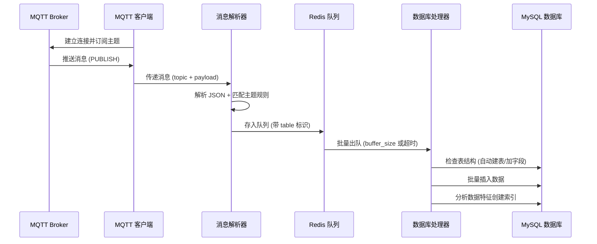

# ThinkPHP 5.0 MQTT 数据采集扩展包
**tp5-mqtt-collector** 是一个专为 **ThinkPHP 5.0** 设计的 MQTT 数据采集扩展包，适用于物联网(IoT)数据采集场景。  
支持自动解析 JSON 消息、动态映射数据库表、自动建表、字段类型识别和索引建议。

---

## 一、功能亮点

✅ **MQTT 协议支持**：基于 Workerman/MQTT 实现高性能客户端  
✅ **断线自动重连**：网络异常或 Broker 断开时自动尝试重连  
✅ **Redis 消息队列**：缓存消息，防止数据丢失  
✅ **批量写入 MySQL**：提高数据库写入性能  
✅ **JSON 自动解析**：自动识别 JSON 格式消息  
✅ **字段类型自动识别**：根据值类型自动映射 MySQL 字段类型  
✅ **自动建表/添加字段**：首次收到消息时自动创建数据表和缺失字段  
✅ **自动索引建议**：根据数据特征自动建议并创建索引  
✅ **ThinkPHP 命令行启动**：符合 ThinkPHP 5.0 开发习惯

---

## 二、系统架构

```mermaid
graph TD
    A[MQTT Broker] -->|发布消息| B[MQTT 客户端<br>(Workerman/MQTT)]
    B -->|断线重连| A
    B -->|接收消息| C[消息解析器<br>(Parser.php)]
    C -->|结构化数据| D[Redis 消息队列<br>(RedisQueue.php)]
    D -->|批量触发/定时触发| E[数据库处理器<br>(DbHandler.php)]
    E -->|自动建表/加字段| F[MySQL 数据库]
    E -->|自动索引建议| F
    G[ThinkPHP 命令行] -->|启动/停止| B
    style A fill:#f9f,stroke:#333,stroke-width:2px
    style B fill:#9f9,stroke:#333,stroke-width:2px
    style D fill:#99f,stroke:#333,stroke-width:2px
    style F fill:#ff9,stroke:#333,stroke-width:2px
```

---

## 三、消息处理流程



---

## 四、安装方法

### 1. 安装扩展包
```bash
composer require yourname/tp5-mqtt-collector
```

### 2. 复制配置文件
```bash
cp vendor/yourname/tp5-mqtt-collector/config/mqtt.php application/config/mqtt.php
```

### 3. 注册命令
在 `application/command.php` 文件中添加：
```php
return [
    'think\mqtt\command\MqttConsumer',
];
```

### 4. 启动服务
```bash
php think mqtt:consumer
```

### 5. 后台运行
```bash
php think mqtt:consumer start -d
```

---

## 五、配置说明

配置文件位置：`application/config/mqtt.php`

```php
return [
    'mqtt' => [
        'host'      => '127.0.0.1', // MQTT Broker 地址
        'port'      => 1883,        // MQTT 端口
        'username'  => '',          // 用户名
        'password'  => '',          // 密码
        'client_id' => 'tp_mqtt_' . uniqid(),
        'topics'    => ['sensor/#', 'device/#'], // 订阅的主题
    ],
    'redis' => [
        'host'     => '127.0.0.1',
        'port'     => 6379,
        'password' => '',
        'db'       => 0,
    ],
    'buffer_size'    => 100, // 批量写入数量
    'buffer_timeout' => 5,   // 批量写入超时时间(秒)
    'index_suggestion' => [
        'enabled'         => true,   // 是否启用索引建议
        'min_selectivity' => 0.1,    // 最低选择性要求
        'check_frequency' => 1000,   // 检查频率
    ],
    'topic_map' => [
        'sensor/+/temp' => [
            'table'    => 'sensor_temp',
            'fields'   => ['device_id', 'temperature', 'humidity'],
            'required' => ['device_id', 'temperature']
        ],
        'device/+/status' => [
            'table'    => 'device_status',
            'fields'   => ['device_id', 'status', 'battery'],
            'required' => ['device_id', 'status']
        ]
    ],
    'default_table' => 'mqtt_messages', // 默认表
];
```

---

## 六、使用示例

### 1. 发布 MQTT 消息
使用 `mosquitto_pub` 工具发布测试数据：
```bash
# 发布传感器温度数据
mosquitto_pub -t "sensor/dev001/temp" -m '{"device_id":"dev001","temperature":25.6,"humidity":60}'

# 发布设备状态数据
mosquitto_pub -t "device/dev002/status" -m '{"device_id":"dev002","status":1,"battery":3.7}'
```

### 2. 数据库验证
扩展包会自动创建对应的数据表并写入数据：
```sql
-- 查看传感器数据表
SELECT * FROM sensor_temp;

-- 查看设备状态表
SELECT * FROM device_status;
```

---

## 七、注意事项

- **数据库编码**：建议使用 `utf8mb4` 编码，支持中文和 Emoji
- **权限问题**：确保数据库用户有建表、修改表结构的权限
- **Redis**：确保 Redis 服务正常运行且配置正确
- **性能优化**：可根据服务器性能调整 `buffer_size` 和 `buffer_timeout` 参数

---

## 八、常见问题

1. **MQTT 连接失败**：检查 Broker 地址、端口和认证信息
2. **Redis 连接失败**：检查 Redis 服务是否运行
3. **数据表创建失败**：检查数据库用户权限
4. **中文乱码**：确保数据库和表使用 utf8mb4 编码
5. **性能问题**：调整批量写入参数

---

## 九、许可证

MIT License

---

## 十、致谢

- [Workerman/MQTT](https://github.com/walkor/mqtt) - PHP MQTT 客户端库
- [ThinkPHP](https://thinkphp.cn) - 优秀的 PHP 开发框架
- [Predis](https://github.com/nrk/predis) - PHP Redis 客户端

---

